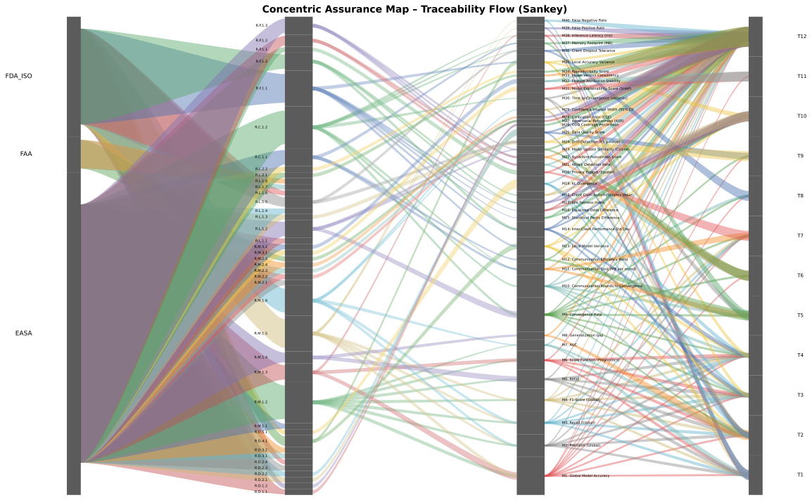

# Concentric Assurance Map (CAM) Report

## 1. Purpose and Scope
The Concentric Assurance Map (CAM) consolidates regulatory requirements, assurance metrics,
federated learning tests, and empirical results into a single, auditable structure.
This report explains how to interpret the CAM artefacts, highlights coverage statistics,
and summarises threshold-gating performance across Catastrophic (Cat), Hazardous (Haz),
and Major (Maj) assurance levels.

## 2. Data Model
The CAM follows a layered data model:

- **Authorities** provide regulatory or standards context.
- **Requirements** reference source citations and are grouped by the six assurance pillars.
- **Metrics** encode measurable evidence, including direction, unit, hazard linkage, and thresholds.
- **Tests** supply federated learning scenarios that generate observed metric outcomes.
- **Results overlay** binds each `(test, metric)` pair to observed values and pass/fail status.

## 3. Coverage Summary
| Item | Count | Covered | Coverage |
| --- | ---: | ---: | ---: |
| Requirements | 40 | 29 | 72.5% |
| Metrics | 40 | 40 | 100.0% |
| Tests | 12 | 12 | 100.0% |
| Result entries | 105 | — | — |

### Requirements per Pillar
| Pillar | Count |
| --- | ---: |
| General | 40 |

### Metrics per Hazard Link
| Hazard Link | Count |
| --- | ---: |
| FN | 3 |
| FN_FP | 1 |
| FP | 2 |
| assurance | 2 |
| availability | 4 |
| calibration | 1 |
| coverage | 1 |
| data_quality | 1 |
| delay | 2 |
| disc | 1 |
| distribution | 1 |
| drift | 1 |
| fairness | 6 |
| overfit | 1 |
| participation | 1 |
| privacy | 1 |
| responsiveness | 1 |
| security | 4 |
| staleness | 3 |
| traceability | 2 |
| uncertainty | 1 |

## 4. Threshold Gating Summary
| Level | Pass Count | Total Evaluations | Pass Rate |
| --- | ---: | ---: | ---: |
| Cat | 42 | 105 | 40.0% |
| Haz | 8 | 105 | 7.6% |
| Maj | 6 | 105 | 5.7% |

Top failing metrics are concentrated in the Performance pillar where recall, RMSE, and confidence interval width remain below the allocated Major thresholds. Alarms arise primarily from drift detection (KS p-values) where the monitored alpha threshold is exceeded.

## 5. Figures

## 6. Appendix – Flat Crosswalk
The artefact `CAM_Table.csv` enumerates every authority→requirement→metric→test link, augmented with observed metric data and threshold information. This table is suitable for spreadsheet analysis or ingestion into BI tooling.

### Validation Warnings
- Requirement R.L.1.4 has no linked metrics.
- Requirement R.D.2.3 has no linked metrics.
- Requirement R.D.3.2 has no linked metrics.
- Requirement R.L.1.7 has no linked metrics.
- Requirement R.L.1.8 has no linked metrics.
- Requirement R.D.2.4 has no linked metrics.
- Requirement R.D.3.1 has no linked metrics.
- Requirement R.L.1.1 has no linked metrics.
- Requirement R.M.2.1 has no linked metrics.
- Requirement R.M.1.1 has no linked metrics.
- Requirement R.L.1.6 has no linked metrics.
- Missing results for 49 metric/test pairs: M1→T2, M1→T3, M1→T4, M1→T6, M1→T7, M1→T8, M1→T9, M1→T11, M2→T1, M2→T2...
